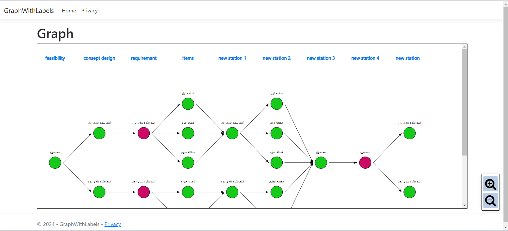

# Product Status Project

Welcome to the Product Status project! This project demonstrates status of product realization graph visualization in an ASP.NET MVC application using .NET 8.
This is actually my first project in my career.


## Getting Started

To set up and run this project, follow the steps below:

### Prerequisites

- [Visual Studio 2022](https://visualstudio.microsoft.com/vs/)
- [SQL Server](https://www.microsoft.com/en-us/sql-server/sql-server-downloads)
- [Navicat](https://www.navicat.com/)

### Setting Up the Database

1. **Import the Tables**:  
   Open Navicat and import the tables provided in the `database source.sql` file.

2. **Configure the Database Connection**:  
   Open the `appsettings.json` file and navigate to line 10. Update the `Server` and `Database` properties based on your SQL Server information. Your configuration should look something like this:

   ```json
   {
      "Logging": {
          "LogLevel": {
          "Default": "Information",
          "Microsoft.AspNetCore": "Warning"
          }
      },
      "AllowedHosts": "*",
      "ConnectionStrings": {
          "DefaultConnection": "Server=DESKTOP-7H3TARN;Database=test;Trusted_Connection=True;TrustServerCertificate=True;"
      }
   }
   ```

### Running the Project

1. **Open Visual Studio**:  
   Open Visual Studio 2022 and load the Product Status project.

2. **Run the Project**:  
   Press `F5` to build and run the project. This will start the application and open it in your default web browser.
## Contact me :))
- [Telegram](https://t.me/mobin_ask)


Good luck!
